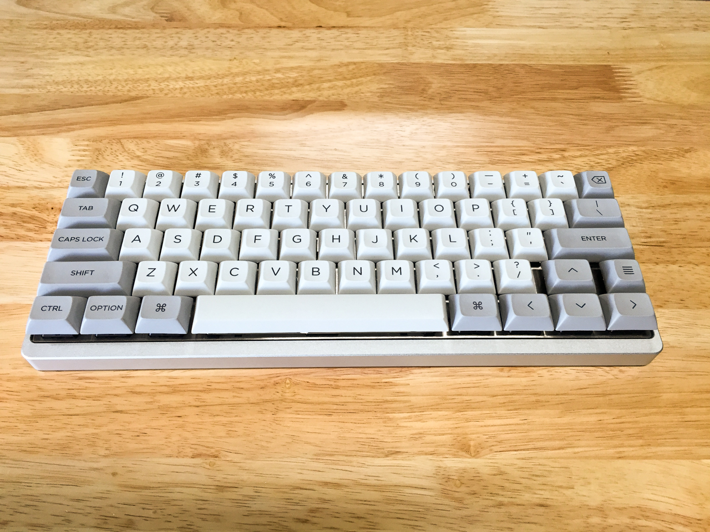
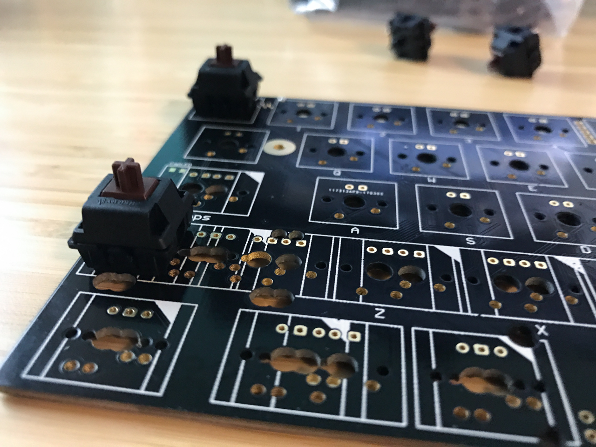
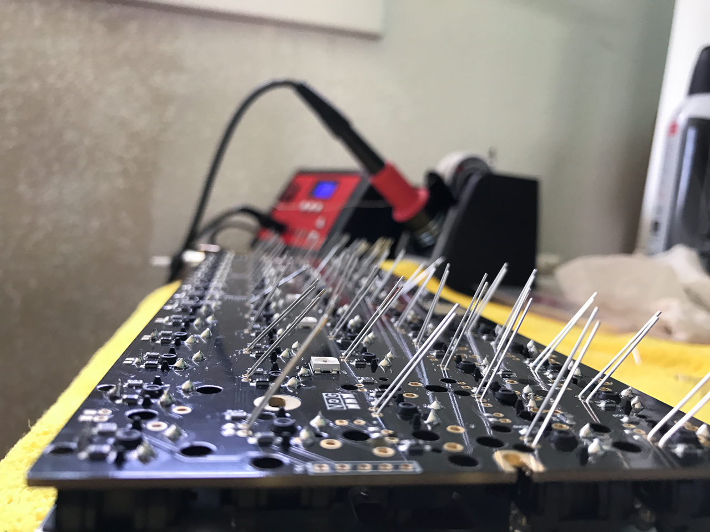
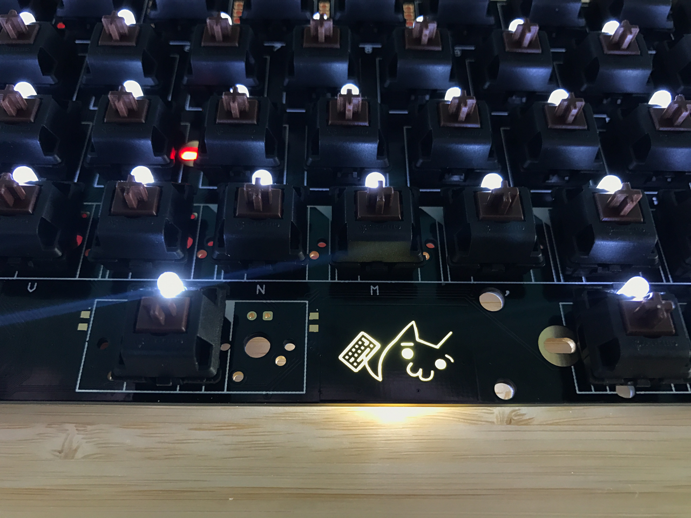
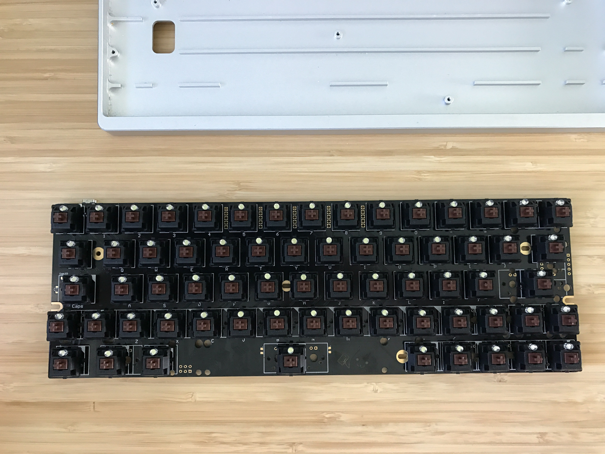
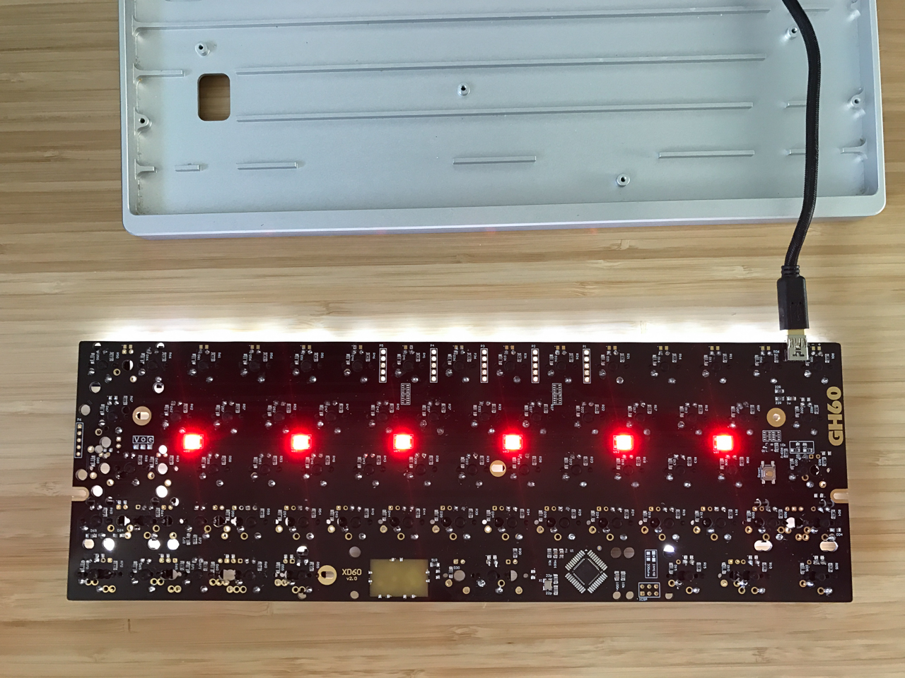
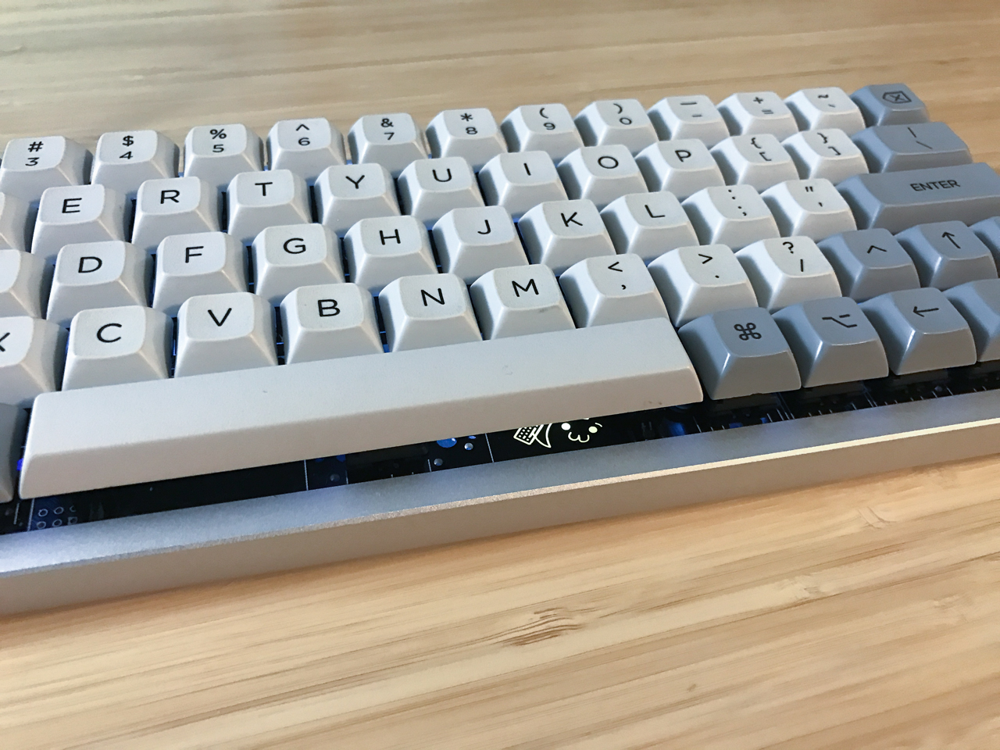

My 60% keyboard with arrow keys XD60 build, with more cat!

With the [drop](https://www.massdrop.com/buy/xd60-xd64-custom-mechanical-keyboard-kit?mode=guest_open) happening right now hopefully I can provide a little insight on this KB.

A little background; I love the idea of arrow keys on 60% keyboards. My daily driver was a modified Infinity with arrow keys:

I was lucky to get 1.25u arrow keys on the first Granite drop to make that build happen. I’ve had my eye on the XD60 for awhile but did not like the idea of moving the ? key or finding a 2u shift so I held off until I had a reason to build another KB.

I picked up the PCB and two plates from Taobao, it took about 2 weeks to get delivered. My original plan was to go with the 2u shift, but at the last moment I decided to try 2x 1u shift. It’s pretty much impossible to get a 2u shift now days. I also decided to try PCB mount switches, my first on all the keyboards I’ve built.

Ordered from Taobao, took about 3 weeks.

Decided to go with PCB mount switches.

After switches soldered I decided to add LED's. I'm not a huge fan of back-lighting but I had 200 white LED's from an old an project.

LED's installed and working. Note that there were 3 switches which had the positive and negative solder points switched. Always double check the LED's before soldering.

Under-glow LED's working as well. Too bad I wont see them with my case.

PCB mount stabilizers.

A few of my thoughts so far: The under-glow is neat but I’ll need a new case. It’s weird having 2x 1u shift, still not used to it yet. PCB mount feels more unstable than plate mount, might be louder also. The cat logo is really cool. I should have used SIP sockets. Down and Right arrow LED have opposite positive and negative terminals.

I've open-sourced the keymap for my keyboard, check it out at [https://github.com/aaronvb/xd60-keymap](https://github.com/aaronvb/xd60-keymap).